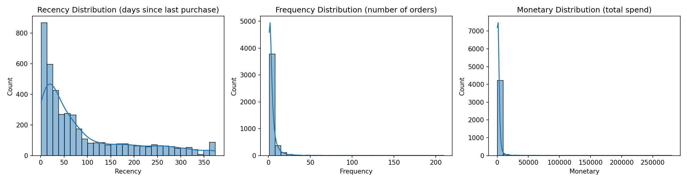
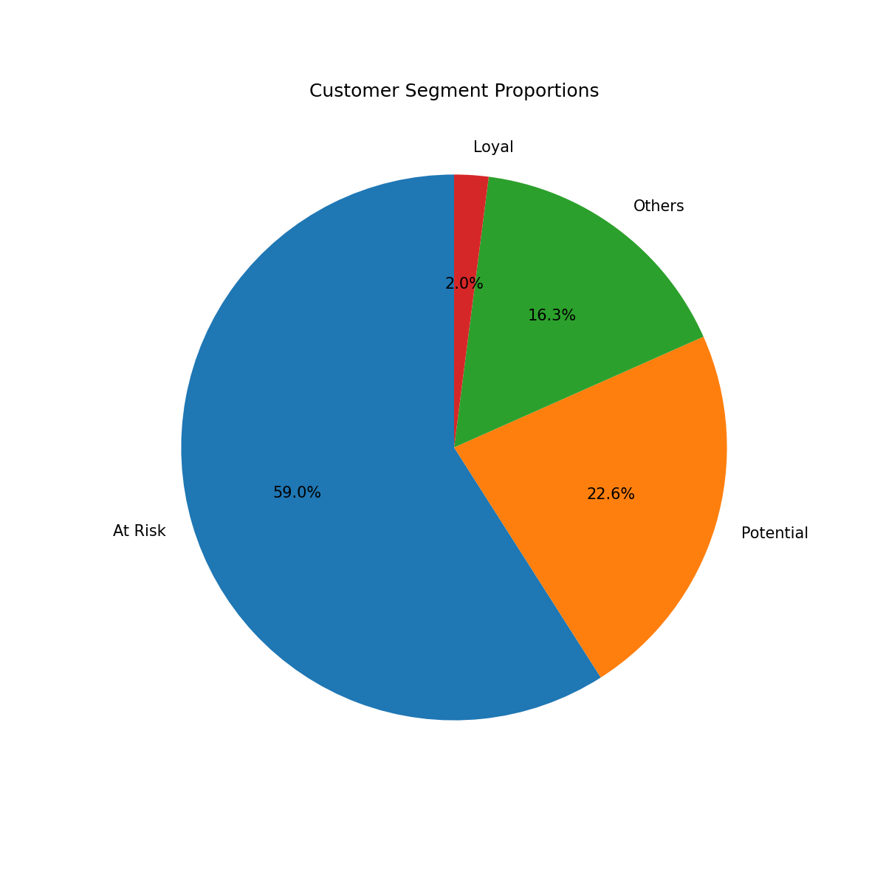
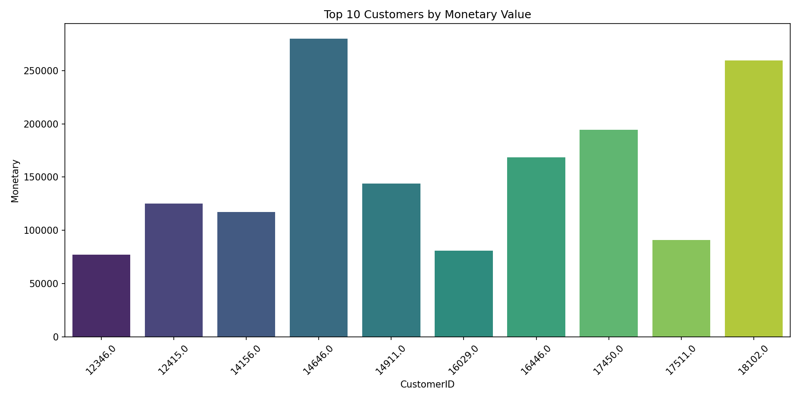

# 📊 Customer Analytics – RFM Segmentation

[](https://www.python.org/)
[](https://pandas.pydata.org/)
[](https://numpy.org/)
[](LICENSE)

This project performs advanced **customer segmentation** using the **RFM analysis** (Recency, Frequency, Monetary) framework on the [UCI Online Retail](https://archive.ics.uci.edu/dataset/352/online+retail) dataset.

The goal is to transform raw transaction data into actionable business intelligence by identifying high-value customer segments such as **Champions**, **Loyal Customers**, and **At-Risk** groups.

---

## 🔍 Business Insights

By analyzing the RFM scores, we categorize customers into actionable segments:

*   🏆 **Champions** (8.5%): Our most valuable customers. *Strategy: Reward them and offer early access to new products.*
*   ⚠️ **At Risk** (22.1%): Customers who haven't purchased in a long time. *Strategy: Re-engagement campaigns and special discounts.*
*   🌟 **Loyal & Potential**: Steady customers with growth capacity. *Strategy: Upselling and loyalty programs.*

---

## 📊 Key Visualizations

###  RFM Metrics Distribution


###  Customer Segment Proportions


###  Top 10 Customers by Monetary Value


---

## 🛠️ Technologies Used

| Technology | Usage |
| :--- | :--- |
| **Python 3.8+** | Core Programming |
| **Pandas** | Data Manipulation & Cleaning |
| **NumPy** | Numerical Computing |
| **Matplotlib** | Data Visualization |

---

## 🚀 How to Run

### 1. Clone the repository
```
git clone https://github.com/mahdirostami2004/Custumer_analytics.git
cd Custumer_analytic
```
### 2. Install dependencies
`pip install -r requirements.txt`
### 3. Run the pipeline
`python scripts/run_all.py`

##📈 Results

    Cleaned data saved as data/cleaned_data.csv

    RFM scores saved as data/rfm_scores.csv

    Charts saved in the reports/ folder
##📚 Dataset Source

[UCI Online Retail](https://archive.ics.uci.edu/ml/datasets/online+retail) – Transaction data from a UK online retailer (2010–2011).
